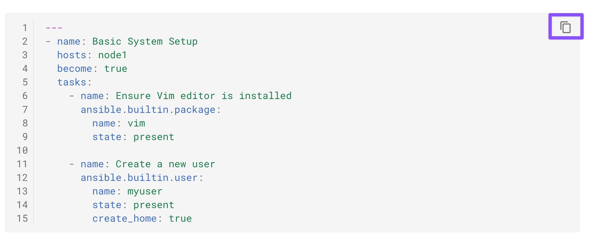
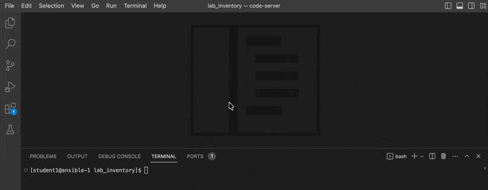
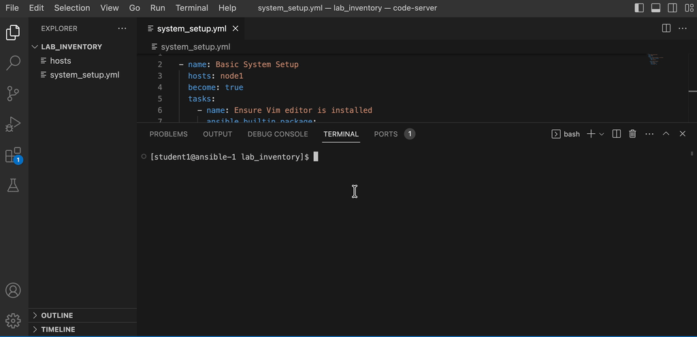

# Workshop Exercise 1 - Writing Your First Playbook

## Tips for this Lab
- Use the VS Code for creating the playbook files. 
- Use the VS Code terminal for running the playbooks and reviewing the output.
- Copy and paste playbook contents from the guide. 

## Table of Contents

  - [Tips for this Lab](#tips-for-this-lab)
  - [Objective](#objective)
  - [Guide](#guide)
    - [Step 1 - Playbook Basics](#step-1---playbook-basics)
    - [Step 2 - Creating Your Playbook](#step-2---creating-your-playbook)
    - [Step 3 - Running the Playbook](#step-3---running-the-playbook)
    - [Step 4 - Checking the Playbook](#step-4---checking-the-playbook)


## Objective

In this exercise, you'll use Ansible to conduct basic system setup tasks on a
Red Hat Enterprise Linux server. You will become familiar with fundamental
Ansible modules like `package` and `user`, and learn how to create and run
playbooks.

## Guide

Playbooks in Ansible are essentially scripts written in YAML format. They are
used to define the tasks and configurations that Ansible will apply to your
servers.

### Step 1 - Playbook Basics
First, create a text file in YAML format for your playbook. Remember:
- Start with three dashes (`---`).
- Use spaces, not tabs, for indentation.

Key Concepts:
- `hosts`: Specifies the target servers or devices for your playbook to run against.
- `tasks`: The actions Ansible will perform.
- `become`: Allows privilege escalation (running tasks with elevated privileges).

> NOTE: An Ansible playbook is designed to be idempotent, meaning if you run it multiple times on the same hosts, it ensures the desired state without making redundant changes.

### Step 2 - Creating Your Playbook

Now create a playbook named `system_setup.yml` to perform basic system setup:
- Install `vim` editor package.
- Create a new user named ‘myuser’.

The basic structure looks as follows:


```yaml
---
- name: Basic System Setup
  hosts: node1
  become: true
  tasks:
    - name: Ensure Vim editor is installed
      ansible.builtin.package:
        name: vim
        state: present
   
    - name: Create a new user
      ansible.builtin.user:
        name: myuser
        state: present
        create_home: true
```

!!! tip "Note"
     Use the exact playbook content provided below. To avoid formatting issues, click the Copy icon on the right side of the code block and paste it into your VS Code playbook file.

> Note: Use the exact playbook content provided below. To avoid formatting issues, click the Copy icon on the right side of the code block and paste it into your VS Code playbook file.



**Steps to create the playbook using VS Code:**

1. In the VS Code , File menu click on "Open Folder".
2. Select the `lab_inventory` folder shown in the directory selection window. Click on `Ok`
3. Open the Explorer view by clicking on the Paper icon on the left vertical menu (first icon). 
4. Click on the New file icon on the explorer view. 
5. Provide the file name `system_setup.yml` and Enter. 
6. On the right side editor view, copy the above yaml file content and paste it. 
7. Save it.

See the gif below for steps:



* About the `package` module: This modules manages packages on a target without specifying a package manager module

* About the `user` module: This module is used to manage user accounts.

### Step 3 - Running the Playbook
Before creating your first playbook, ensure you are in the correct directory by changing to `~/lab_inventory`:
Change to lab_inventory directory
```bash
cd ~/lab_inventory
```

Execute your playbook using the `ansible-navigator` command:
Run the playbook
```bash
ansible-navigator run system_setup.yml -m stdout
```
> NOTE: Installing the packages may take a few minutes to complete.

Here is the gif showing how to run the playbook in VS Code terminal: 



Review the output to ensure each task is completed successfully.

```bash

PLAY [Basic System Setup] ******************************************************

TASK [Gathering Facts] *********************************************************
ok: [node1]

TASK [Ensure Vim editor is installed] *************************************
ok: [node1]

TASK [Create a new user] *******************************************************
changed: [node1]

PLAY RECAP *********************************************************************
node1                      : ok=3    changed=1    unreachable=0    failed=0    skipped=0    rescued=0    ignored=0  
```
#### Understanding the Ansible Playbook Output

##### Output Status Meanings

- **`ok`**: Task completed successfully without making any changes. Shown in Green in color.
    - The desired state was already present or achieved
    - No system modifications were needed

- **`changed`**: Task completed successfully and made changes to the system. Shown in Yellow/Orange in color.
    - The system state was modified to match the desired state
    - Files, packages, or configurations were altered

- **`fatal`**: Task failed to execute successfully. Shown in Red in color.

##### Example: "Ensure Vim editor is installed" Task

In the previous output, this task shows **`ok`** status because:

- **Vim is already installed** on the system
- The desired state (vim present) **already matches the actual state**
- Ansible detected no action was needed
- **No changes were made** to the system

##### Key Takeaway
✓ **`ok` = Goal already met. Nothing to do.**


#### Idempotency in Action: Running the Playbook Again

Now, let's run the `system_setup.yml` playbook a second time to demonstrate **idempotency**:

```bash
ansible-navigator run system_setup.yml -m stdout
```

Notice the output this time:

```bash

PLAY [Basic System Setup] ******************************************************

TASK [Gathering Facts] *********************************************************
ok: [node1]

TASK [Ensure Vim editor is installed] *************************************
ok: [node1]

TASK [Create a new user] *******************************************************
ok: [node1]

PLAY RECAP *********************************************************************
node1                      : ok=3    changed=0    unreachable=0    failed=0    skipped=0    rescued=0    ignored=0  
```

##### What Changed?

The **"Create a new user"** task now shows **`ok`** instead of **`changed`** because:

- **The user 'myuser' already exists** from the previous playbook run
- Ansible detected that the desired state (user present) **already matches the actual state**
- **No modifications were made** to the system
- The playbook is **idempotent** — running it multiple times produces the same result without redundant changes

This demonstrates a key principle of Ansible: **idempotent playbooks ensure predictable, repeatable infrastructure configuration.**

### Step 4 - Second Playbook to check the status
Now, let’s create a second playbook for post-configuration checks, named `system_checks.yml` in the same folder:
> Use VS Code to create the second playbook, similar to the first one. Use the exact content provided below.

```yaml
---
- name: System Configuration Checks
  hosts: node1
  become: true
  tasks:
    - name: Check user existence
      ansible.builtin.command:
        cmd: id myuser
      register: user_check
 
    - name: Report user status
      ansible.builtin.debug:
        msg: "User 'myuser' exists."
      when: user_check.rc == 0
```

Run the checks playbook:

```bash
ansible-navigator run system_checks.yml -m stdout
```
> Note: If you encounter a file not found error, ensure you are in the ~/lab_inventory directory and that the system_checks.yml file exists. Common issues include incorrect file names, creating the file in a different directory, or running the command from the wrong location.

Review the output to ensure the user creation was successful.

```bash

PLAY [System Configuration Checks] *********************************************

TASK [Gathering Facts] *********************************************************
ok: [node1]

TASK [Check user existence] ****************************************************
changed: [node1]

TASK [Report user status] ******************************************************
ok: [node1] => {
    "msg": "User 'myuser' exists."
}

PLAY RECAP *********************************************************************
node1                      : ok=3    changed=1    unreachable=0    failed=0    skipped=0    rescued=0    ignored=0  
```

- The `Report user status` task shows that the `myuser` user was created successfully by our first playbook.

---


