# Workshop Exercise 2 - Projects & Job Templates

## Table Contents

* [Objective](#objective)
* [Guide](#guide)
* [Setup Git Repository](#setup-git-repository)
* [Create the Project](#create-the-project)
* [Create a Job Template and Run a Job](#create-a-job-template-and-run-a-job)
* [Challenge Lab: Check the Result](#challenge-lab-check-the-result)
* [What About Some Practice?](#what-about-some-practice)

## Objective

- Red Hat Ansible Automation Platform is like a **full kitchen**. It has many tools and components that work together to help you automate tasks at an enterprise level.  

- One important part of this kitchen is the **Ansible Automation Platform Controller**. It helps you run your automation jobs in a secure and controlled way.  

- To run an automation job, the Controller uses a few key objects:

    - **Projects**: A collection of playbooks (automation scripts). These are usually stored in a version control system like Git.  

    - **Inventory**: A list of systems (servers or nodes) where your automation will run.  

    - **Credentials**: Secure information (like usernames, passwords, or SSH keys) used to connect to your systems.  

    - **Execution Environment Image**: Think of this as a **Lego box set** 🧱. It contains all the tools, modules (Legos), and dependencies needed to run your automation (playbook).  

    - **Job Template**: This is the **blueprint** that connects everything together (project, inventory, credentials, and execution environment) to run an automation job.  


### What You Will Do

In this exercise, you will:

1. Create a new **Project** using an existing playbook repository  
2. Create a **Job Template**  
3. Run your first automation job using the Ansible Automation Platform Controller  

By the end, you will understand how all these components work together—just like using the right tools in a full kitchen.


## Guide

### Setup Git Repository

For this demonstration, we will use playbooks stored in a Git repository:

[https://github.com/ansible/workshop-examples](https://github.com/ansible/workshop-examples)

A playbook to install the Apache web server has already been committed to the directory **rhel/apache**, `apache_install.yml`:

```yaml
---
- name: Apache server installed
  hosts: web

  tasks:
  - name: latest Apache version installed
    ansible.builtin.yum:
      name: httpd
      state: latest

  - name: latest firewalld version installed
    ansible.builtin.yum:
      name: firewalld
      state: latest

  - name: firewalld enabled and running
    ansible.builtin.service:
      name: firewalld
      enabled: true
      state: started

  - name: firewalld permits http service
    ansible.builtin.firewalld:
      service: http
      permanent: true
      state: enabled
      immediate: yes

  - name: Apache enabled and running
    ansible.builtin.service:
      name: httpd
      enabled: true
      state: started
```
> **Note:**
> Observe the difference from other playbooks you might have written! Most importantly, there is no `become` and `hosts` is set to `web`. When you set hosts to `web`, the playbook automates all hosts in that group (node1, node2, and node3) in parallel. This enables consistent automation across a large scale of hosts. 


To configure and use this repository as a **Source Control Management (SCM)** system in automation controller you have to create a **Project** that uses the repository

### Create the Project

* Ansible Automation Platform 2.4 : Go to **Resources → Projects** click the **Add** Project button. Fill in the form:

* If you do not see the `Resources` menu on the side, your environment is likely running Ansible Automation Platform version 2.5 or later. In that case, go to **Automation Execution → Projects** , then click the **Create Project** button and fill in the form.


 <table>
   <tr>
     <th>Parameter</th>
     <th>Value</th>
   </tr>
   <tr>
     <td>Name</td>
     <td>Workshop Project</td>
   </tr>
   <tr>
     <td>Organization</td>
     <td>Default</td>
   </tr>
   <tr>
     <td>Execution Environment</td>
     <td>Default execution environment</td>
   </tr>
   <tr>
     <td>Source Control Type</td>
     <td>Git</td>
   </tr>
 </table>

 Enter the URL into the Project configuration:

 <table>
   <tr>
     <th>Parameter</th>
     <th>Value</th>
   </tr>
   <tr>
     <td>Source Control URL</td>
     <td><code>https://github.com/ansible/workshop-examples.git</code></td>
   </tr>
   <tr>
     <td>Options</td>
     <td>Optional: Select Clean, Delete, Update Revision on Launch to request a fresh copy of the repository and to update the repository when launching a job.</td>
   </tr>
 </table>

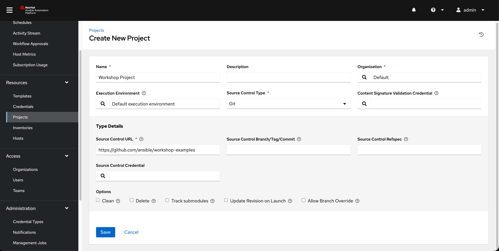

* Click **Save** or **Create project**


The new project will be synced automatically after creation. But you can also do this manually: Sync the Project again by selecting the 'Sync project' blue button.

After starting the sync job, go to the **Jobs** view, and you'll find the job doing the project update.

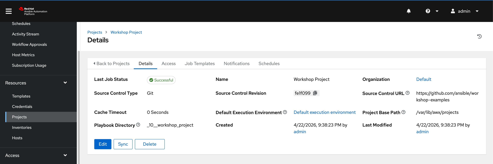

You should see "Successful" in the "Last Job Status" before you proceed.

### Create a Job Template and Run a Job

A job template allows you to run an automation job. In order to run any type of automation, a job template must be created. A job template consists of knowning the following information:

* **Inventory**: On what hosts should the job run?

* **Credentials** What credentials are needed to log into the hosts?

* **Project**: Where is the playbook?

* **Playbook**: What playbook to use?

The **Workshop Inventory** and **Workshop Credential** have been pre-configured for this workshop. You can explore their details by navigating to **Resources → Inventories** for the inventory and **Resources → Credentials** for the credentials. Feel free to review them before proceeding.

* If you do not see the `Resources` menu on the side, your environment is likely running Ansible Automation Platform version 2.5 or later. In that case, go to **Automation Execution → Infrastructure → Inventories → Workshop Inventory** , for credentials **Automation Execution → Infrastructure → Credentials → Workshop Credential**

**Workshop Inventory** 

Resources → Inventories → Workshop Inventory → Hosts (Tab)
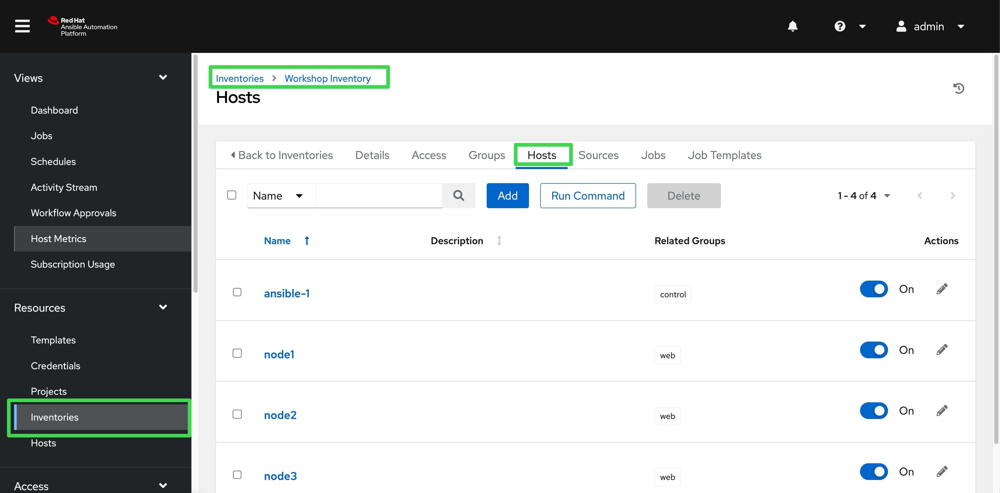

Resources → Inventories → Workshop Inventory → Groups (Tab) → web
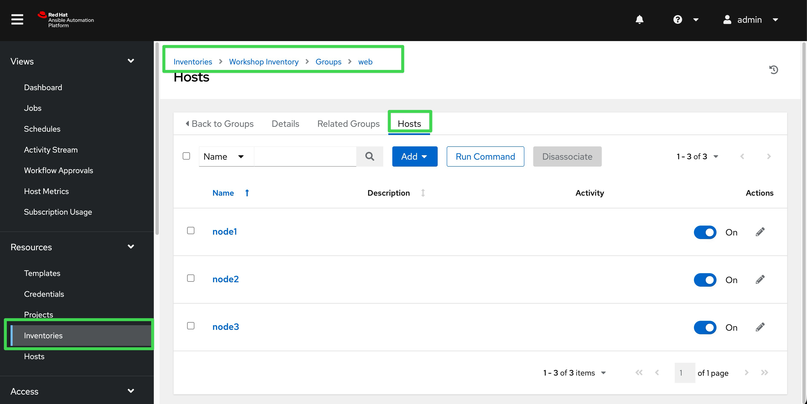

**Workshop Credential**
Resources → Credentials → Workshop Credential
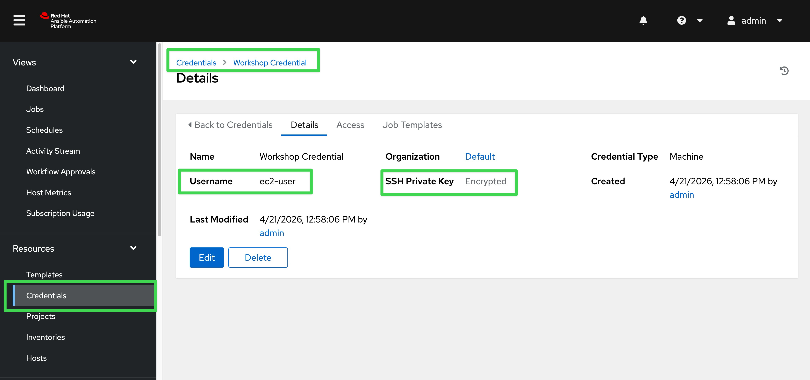

> **Note**
> Credentials are securely stored in encrypted format. Even as an administrator, you cannot retrieve them in plain text.


**Job Template**

To create a Job Template, go to the **Resources -> Templates** view,click the **Create template** button and choose **Create job template**.

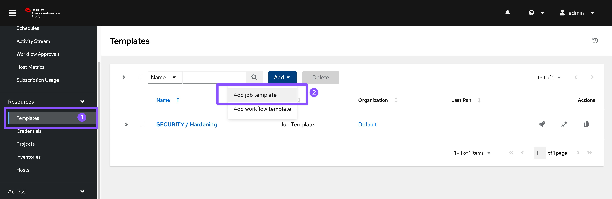

* If you do not see the `Resources` menu on the side, your environment is likely running Ansible Automation Platform version 2.5 or later. In that case, go to the **Automation Execution -> Templates** view,click the **Create template** button and choose **Create job template**.

Fill in the following form:

> **Tip**
>
> Remember that you can often click on the question mark with a circle to get more details about the field.

 <table>
   <tr>
     <th>Parameter</th>
     <th>Value</th>
   </tr>
   <tr>
     <td>Name</td>
     <td>Install Apache</td>
   </tr>
   <tr>
     <td>Job Type</td>
     <td>Run</td>
   </tr>
   <tr>
     <td>Inventory</td>
     <td>Workshop Inventory</td>
   </tr>
   <tr>
     <td>Project</td>
     <td>Workshop Project</td>
   </tr>
   <tr>
     <td>Playbook</td>
     <td><code>rhel/apache/apache_install.yml</code></td>
   </tr>
   <tr>
     <td>Execution Environment</td>
     <td>Default execution environment</td>
   </tr>
   <tr>
     <td>Credentials</td>
     <td>Workshop Credential</td>
   </tr>
   <tr>
     <td>Limit</td>
     <td>web</td>
   </tr>
   <tr>
     <td>Options</td>
     <td>tasks need to run as root so check **Privilege Escalation**</td>
   </tr>
 </table>

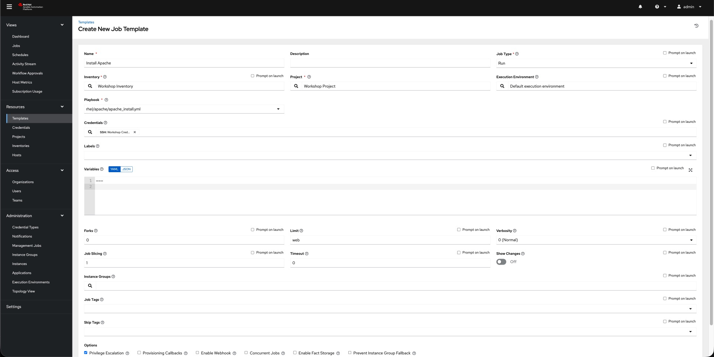

* Click **Save** or **Create job template**

You can start the job by directly clicking the blue **Launch template** button, or by clicking on the rocket in the Job Templates overview. After launching the Job Template, you are automatically brought to the job overview where you can follow the playbook execution in real time.

Template Details
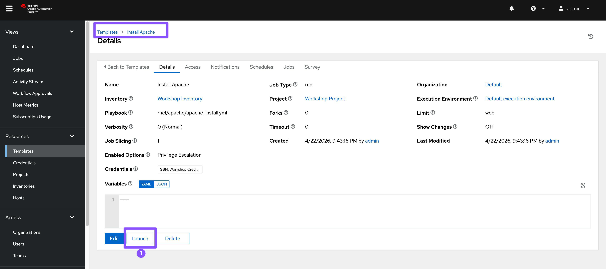

Job Run
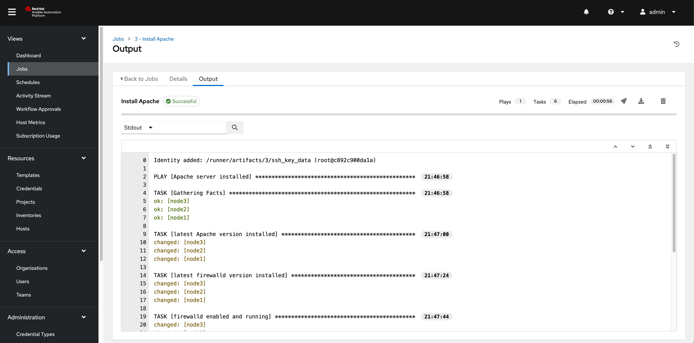

Since this might take some time, have a closer look at all the details provided:

* All details of the job template like inventory, project, credentials and playbook are shown.

* Additionally, the actual revision of the playbook is recorded here - this makes it easier to analyse job runs later on.

* Also the time of execution with start and end time is recorded, giving you an idea of how long a job execution actually was.

* Selecting **Output** shows the output of the running playbook. Click on a node underneath a task and see that detailed information are provided for each task of each node.

After the Job has finished go to the main **Jobs** view: All jobs are listed here, you should see directly before the Playbook run an Source Control Update was started. This is the Git update we configured for the **Project** on launch\!

### Challenge Lab: Check the Result

Time for a little challenge:

* Use an ad hoc command on both hosts to make sure Apache has been installed and is running.

You have already been through all the steps needed, so try this for yourself.

> **Tip**
> What about `systemctl status httpd`?


> **Warning**
>
> **Solution Below**

* Go to `Resources → Inventories → Workshop Inventory`
  * If you do not see the `Resources` menu on the side, your environment is likely running Ansible Automation Platform version 2.5 or later. In that case, go to **Automation Execution → Infrastructure →  Inventories** → **Workshop Inventory**

* Select the **Hosts** tab and select `node1`, `node2`, `node3` and click **Run Command**

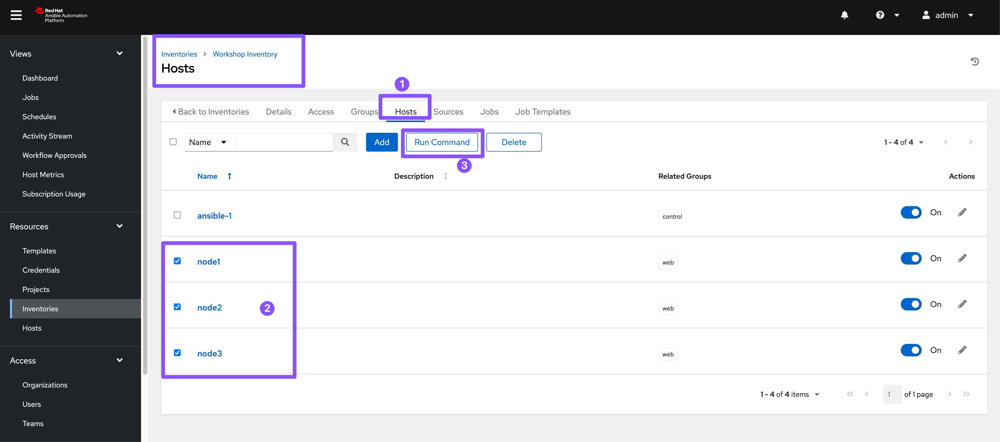

Within the **Details** window, select **Module** `command`, in **Arguments** type `systemctl status httpd` and click **Next**.

Within the **Execution Environment** window, select **Default execution environment** and click **Next**.

Within the **Credential** window, select **Workshop Credentials** and click **Next**.

Review your inputs and click **Launch**.
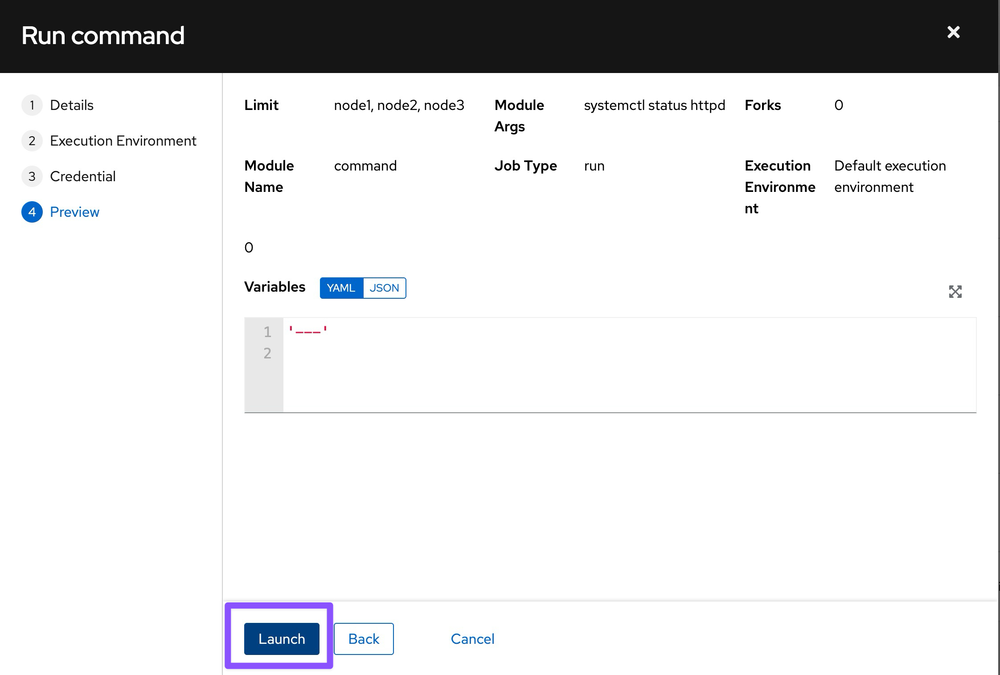

Verify that the output result is as expected.

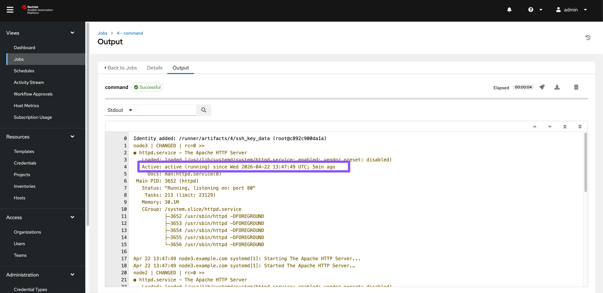

> The output of the results is displayed once the command has completed.

---


