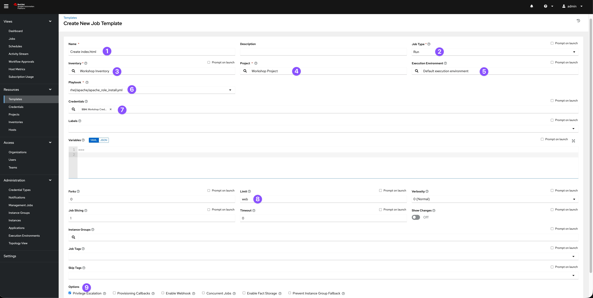
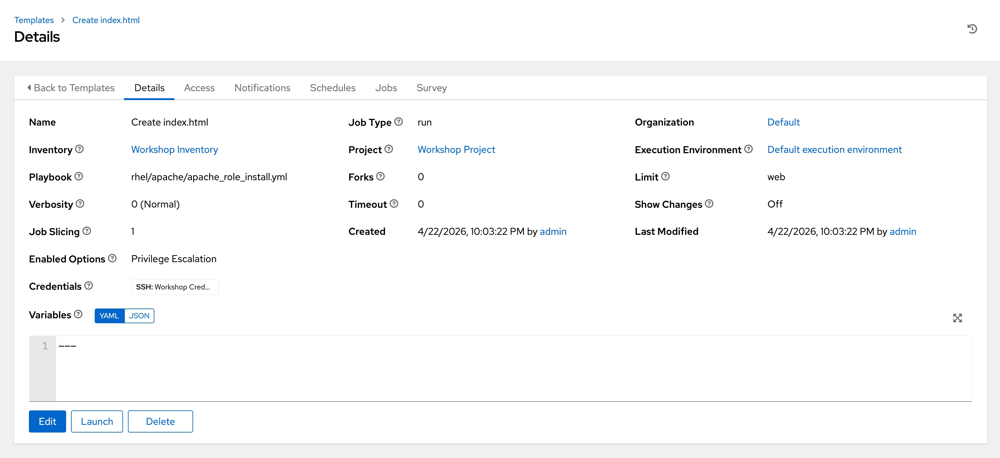
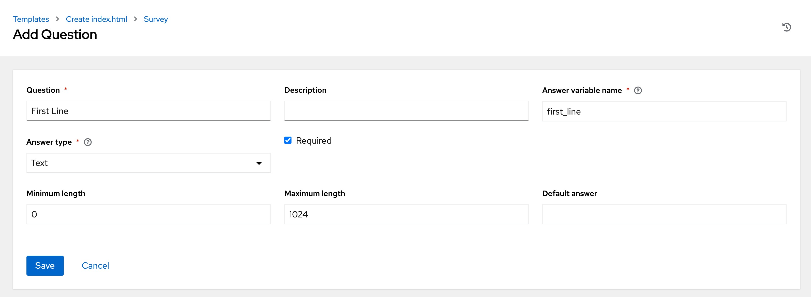
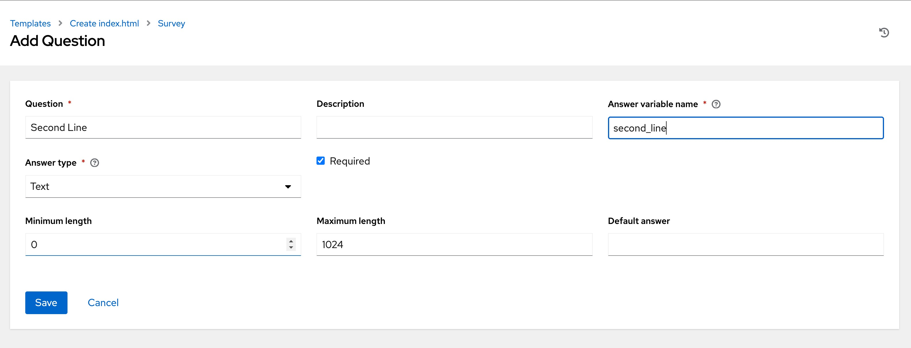
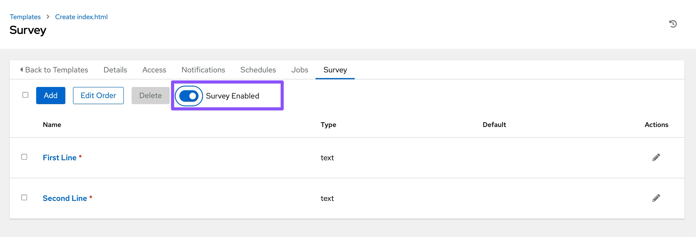
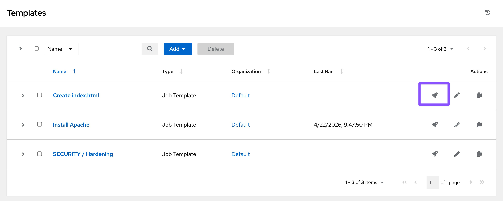
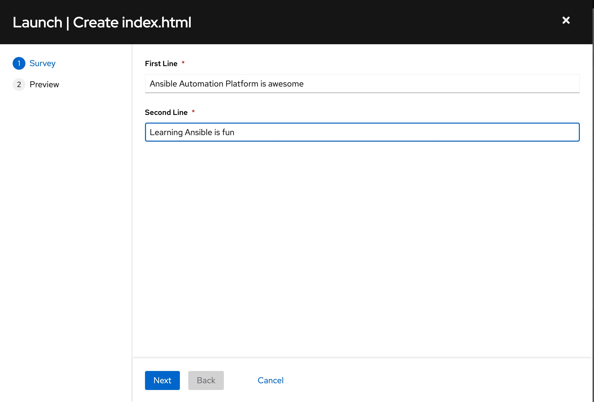
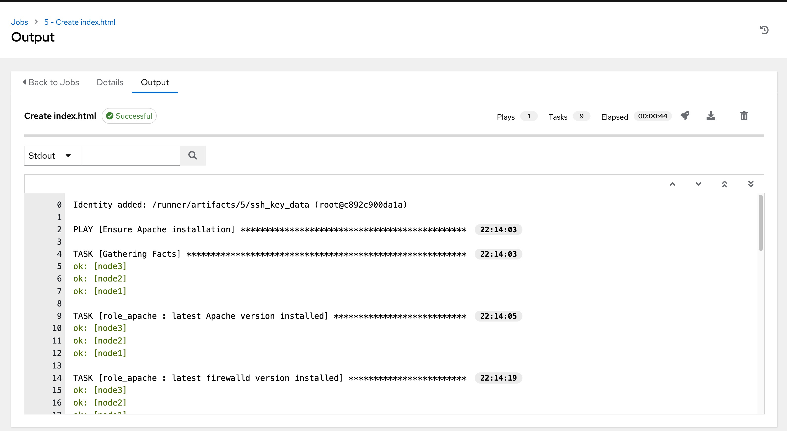
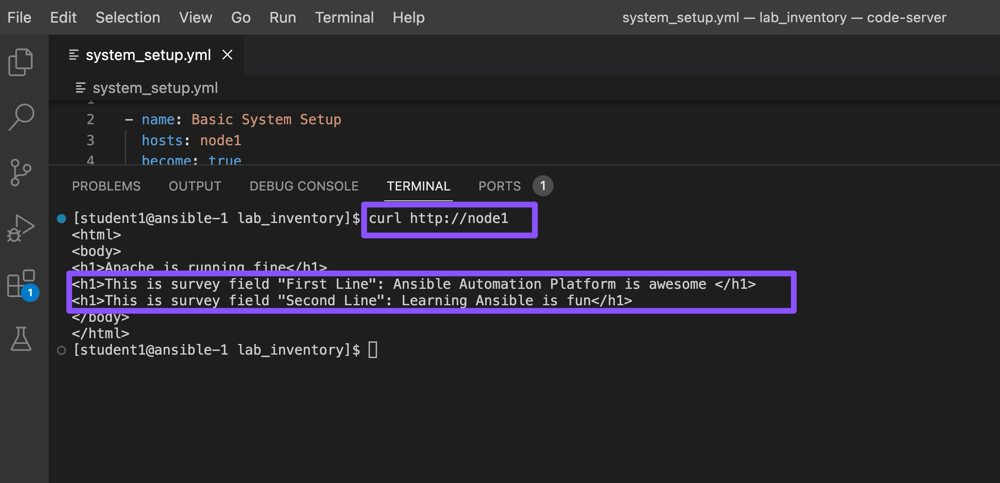

# Exercise 3 - Surveys

## Table of Contents

  - [Objective](#objective)
  - [Guide](#guide)
    - [The Apache-Configuration Role](#the-apache-configuration-role)
    - [Create a Template with a Survey](#create-a-template-with-a-survey)
      - [Create Template](#create-template)
      - [Add the Survey](#add-the-survey)
    - [Launch the Template](#launch-the-template)

## Objective

### Job Template Survey

A Job Template **Survey** allows you to ask the user questions before running an automation job.

Instead of editing the playbook or typing values manually, the survey provides a simple **question-and-answer form**.

#### Why use a Survey?

- Makes it easy for users to provide input  
- Avoids typing mistakes  
- Ensures the correct format of input (for example: numbers, text, yes/no)  
- No need to change the playbook  

#### How it works

When you launch a job template with a survey:
1. You will see a set of questions  
2. You enter your answers  
3. The job runs using your inputs  

#### Example

You might use questions like:

- What is the package name to install?  
- Which environment do you want to target (dev/test/prod)?  
- Enter the username  

Your answers are then used by the automation job.

### What You Will Do

In this exercise, you will:

1. Create a **Survey** for a Job Template  
2. Add a few simple questions  
3. Run the job and provide answers through the survey  

This helps you understand how to make automation more interactive and user-friendly.

Refer the [survey documentation](https://docs.redhat.com/en/documentation/red_hat_ansible_automation_platform/latest/html/using_automation_execution/controller-job-templates#controller-surveys-in-job-templates) for more details.

## Guide

You've installed Apache on all hosts in the job you just ran. Now, let's build on this:

- Use a proper role that includes a Jinja2 template to deploy an `index.html` file.
- Create a job **Template** with a survey to collect values for the `index.html` template.
- Launch the job **Template**.

Additionally, the role will ensure that the Apache configuration is set up correctly for this exercise.

> **Tip**
> The survey feature provides a simple query for data but does not support dynamic data queries, nested menus, or four-eye principles.

### The Apache-Configuration Role

The playbook and role with the Jinja2 template are located in the GitHub repository [https://github.com/ansible/workshop-examples](https://github.com/ansible/workshop-examples) in the `rhel/apache` directory.

- Have a look at the playbook `apache_role_install.yml`, which references the role.
- The role is located in the `roles/role_apache` subdirectory.
- Inside the role, note the two variables in the `templates/index.html.j2` template file marked by `{{…​}}`.
- The `tasks/main.yml` file deploys the template.

The playbook creates a file (**dest**) on the managed hosts from the template (**src**).

Because the playbook and role are located in the same GitHub repo as the `apache_install.yml` playbook, you don't need to configure a new project for this exercise.

### Create a Template with a Survey

Now, let's create a new Template that includes a survey.

#### Create Template

1. Go to **Resources → Templates**, click the **Add** button, and choose **Add job Template**.

* If you do not see the `Resources` menu on the side, your environment is likely running Ansible Automation Platform version 2.5 or later. In that case, go to the **Automation Execution -> Templates** view,click the **Create template** button and choose **Create job template**.

2. Fill out the following details:

| Parameter                  | Value                           |
|-----------------------------|---------------------------------|
| Name                        | Create index.html               |
| Job Type                    | Run                             |
| Inventory                   | Workshop Inventory              |
| Project                     | Workshop Project                |
| Playbook                    | `rhel/apache/apache_role_install.yml` |
| Execution Environment        | Default execution environment   |
| Credentials                 | Workshop Credential             |
| Limit                       | web                             |
| Options                     | Privilege Escalation            |

3. Click **Save** or **Create job template**.

> **Warning**
> **Do not run the template yet!**

#### Add the Survey

1. In the Template, click the **Survey** tab, then click **Add** or **Create survey question**.
2. Fill out the following for the first survey question:

| Parameter                  | Value           |
|-----------------------------|-----------------|
| Question                    | First Line      |
| Answer Variable Name        | first_line      |
| Answer Type                 | Text            |

3. Click **Save** or **Create survey question**.
4. Click **Add** or **Create survey question** to create a second survey question:

| Parameter                  | Value           |
|-----------------------------|-----------------|
| Question                    | Second Line     |
| Answer Variable Name        | second_line     |
| Answer Type                 | Text            |

5. Click **Create survey question**.
6. Enable the survey by toggling the **Survey disabled** button to the `ON` positon. 

> Warning: Make sure to enable the Survey. Otherwise, it will not show up when launching the Job Template. 

### Launch the Template

Now, launch the **Create index.html** job template by clicking the **Launch template** button.

Before the job starts, the survey will prompt for **First Line** and **Second Line**. Enter your text and click **Next**. The **Preview** window shows the values—if all looks good, click **Launch** or **Finish** to start the job.

Template Launch: 

Survey Fill: 

Survey Review and Launch: 

Once the job completes, verify the Apache homepage by running the following `curl http://node1` command in the SSH console on the control host (In VS Code Terminal window).

**Alternatively**, You can run adhoc command on `node1`:

* Go to `Resources → Inventories → Workshop Inventory`
  * If you do not see the `Resources` menu on the side, your environment is likely running Ansible Automation Platform version 2.5 or later. In that case, go to **Automation Execution → Infrastructure →  Inventories** → **Workshop Inventory**

* Select the Hosts tab and select `node1` and click Run Command

* Within the Details window, select Module command, in Arguments type `curl http://node1` and click Next.

* Within the Execution Environment window, select Default execution environment and click Next.

* Within the Credential window, select Workshop Credentials and click Next.

* Review your inputs and click Finish.

Verify that the output result is as expected.

---

