# Workshop Bonus Exercise 4 - Workflows

> **Important:**  
> This is a bonus exercise and is optional.

!!! tip "Important"
    This is a bonus exercise and is optional.

## Table of Contents

* [Objective](#objective)
* [Guide](#guide)
  * [Lab scenario](#lab-scenario)
  * [Set up projects](#set-up-projects)
  * [Set up job templates](#set-up-job-templates)
  * [Set up the workflow](#set-up-the-workflow)
  * [Launch workflow](#launch-workflow)

## Objective

### Workflow

A **Workflow** allows you to connect multiple automation jobs together and run them in a sequence.

Think of it like following steps in a process — where one step leads to the next. 

This flexibility allows different teams to collaborate efficiently. For example, a networking team can manage its own repositories and inventories, while an operations team handles other aspects.

#### Why use a Workflow?

- Run multiple jobs automatically in order
- Jobs can run in parallel or sequential
- Control what happens next based on success or failure  
- Avoid running each job manually  

#### How it works

A workflow connects different job templates like a flowchart:

- If one job **succeeds**, the next job runs  
- If a job **fails**, you can run a different job  

#### Example

Imagine a simple process:

1. Check if servers are ready  
2. If successful → Install a package  
3. If it fails → Run a troubleshooting job  

The workflow handles this automatically without manual steps.

#### What can be included in a Workflow?

- Job Templates (run playbooks)  
- Project updates (get latest code)  
- Inventory updates (refresh system list)  

### What You Will Do

In this exercise, you will:

1. Create a **Workflow Template**  
2. Add multiple job templates  
3. Connect them in order  
4. Run the workflow  

## Guide

> Note: The screenshots in this guide are from Ansible Automation Platform 2.4. If your environment is running version 2.5 or later, the interface may look slightly different, but the key fields remain the same.

### Lab scenario

You have two departments in your organization:

* **Web operations team:** developing playbooks in their Git branch `webops`.
* **Web developers team:** working in their branch `webdev`.

When a new Node.js server is needed, the following tasks must be performed:

#### Web operations team tasks

* Install `httpd`, `firewalld`, and `node.js`.
* Configure `SELinux` settings, open the firewall, and start `httpd` and `node.js`.

#### Web developers team tasks

* Deploy the latest version of the web application and restart `node.js`.

The web operations team sets up the server, and the developers deploy the application.

> **Note:**  
> For this example, both teams use branches of the same Git repository. In a real scenario, your source control structure may vary.

---

### Set up projects

First, set up the Git repositories as projects.

> **Warning:**  
> If logged in as **wweb**, log out and log in as **admin**.

* Ansible Automation Platform 2.4 : Go to **Resources → Projects** click the **Add** button. Fill in the form:

* If you do not see the `Resources` menu on the side, your environment is likely running Ansible Automation Platform version 2.5 or later. In that case, go to **Automation Execution → Projects** , then click the **Create Project** button and fill in the form.

Set up the web operations team’s project:

<table>
  <tr>
    <th>Parameter</th>
    <th>Value</th>
  </tr>
  <tr>
    <td>Name</td>
    <td>Webops Git Repo</td>
  </tr>
  <tr>
    <td>Organization</td>
    <td>Default</td>
  </tr>
    <tr>
    <td>Execution Environment</td>
    <td>Default execution environment</td>
  </tr>
  <tr>
    <td>Source control type</td>
    <td>Git</td>
  </tr>
  <tr>
    <td>Source control URL</td>
    <td><code>https://github.com/ansible/workshop-examples.git</code></td>
  </tr>
  <tr>
    <td>Source control branch/tag/commit</td>
    <td><code>webops</code></td>
  </tr>
  <tr>
    <td>Options</td>
    <td><ul><li>✓ Clean</li><li>✓ Delete</li><li>✓ Update Revision on Launch</li></ul></td>
  </tr>
</table>

Click **Save** or **Create project**. 

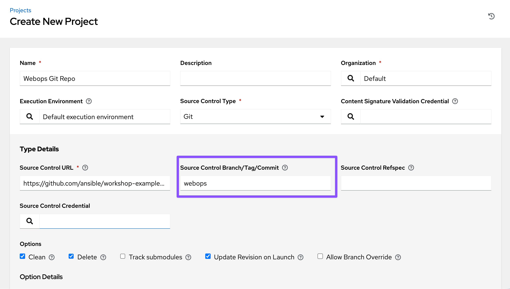

Repeat the process to set up the **Webdev Git Repo**, using the branch `webdev`.
<table>
  <tr>
    <th>Parameter</th>
    <th>Value</th>
  </tr>
  <tr>
    <td>Name</td>
    <td>Webdev Git Repo</td>
  </tr>
  <tr>
    <td>Organization</td>
    <td>Default</td>
  </tr>
    <tr>
    <td>Execution Environment</td>
    <td>Default execution environment</td>
  </tr>
  <tr>
    <td>Source control type</td>
    <td>Git</td>
  </tr>
  <tr>
    <td>Source control URL</td>
    <td><code>https://github.com/ansible/workshop-examples.git</code></td>
  </tr>
  <tr>
    <td>Source control branch/tag/commit</td>
    <td><code>webdev</code></td>
  </tr>
  <tr>
    <td>Options</td>
    <td><ul><li>✓ Clean</li><li>✓ Delete</li><li>✓ Update Revision on Launch</li></ul></td>
  </tr>
</table>

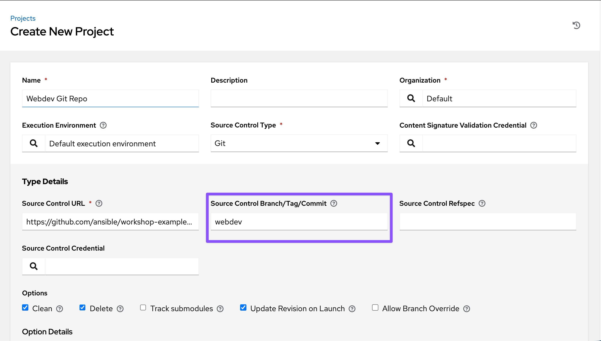

Sync the Projects. Ensure the status shows `Successful` before proceeding.
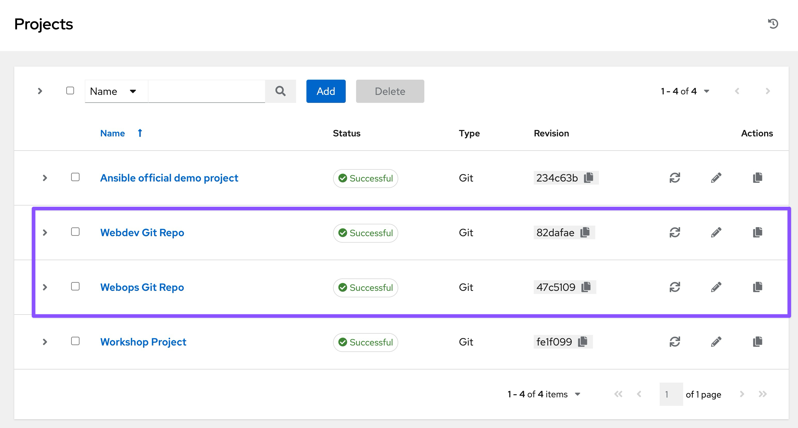

---

### Set up job templates

1. Go to **Resources → Templates**, click the **Add** button, and choose **Add job Template**.

* If you do not see the `Resources` menu on the side, your environment is likely running Ansible Automation Platform version 2.5 or later. In that case, go to the **Automation Execution -> Templates** view,click the **Create template** button and choose **Create job template**.

Fill out the form with the following values:

<table>
  <tr>
    <th>Parameter</th>
    <th>Value</th>
  </tr>
  <tr>
    <td>Name</td>
    <td>Web App Deploy</td>
  </tr>
  <tr>
    <td>Inventory</td>
    <td>Workshop Inventory</td>
  </tr>
  <tr>
    <td>Project</td>
    <td>Webops Git Repo</td>
  </tr>
  <tr>
    <td>Playbook</td>
    <td><code>rhel/webops/web_infrastructure.yml</code></td>
  </tr>
  <tr>
    <td>Execution Environment</td>
    <td>Default execution environment</td>
  </tr>
  <tr>
    <td>Credentials</td>
    <td>Workshop Credentials</td>
  </tr>
  <tr>
    <td>Options</td>
    <td>tasks need to run as root so check **Privilege Escalation**</td>
  </tr>
</table>

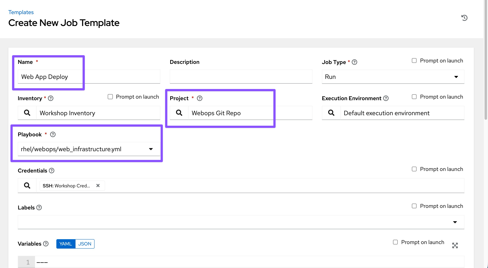

Click **Save** or **Create job template**, and then repeat the process for the **Node.js Deploy** template, changing the project to **Webdev Git Repo** and the playbook to `rhel/webdev/install_node_app.yml`.

Node.js Deploy Template: 
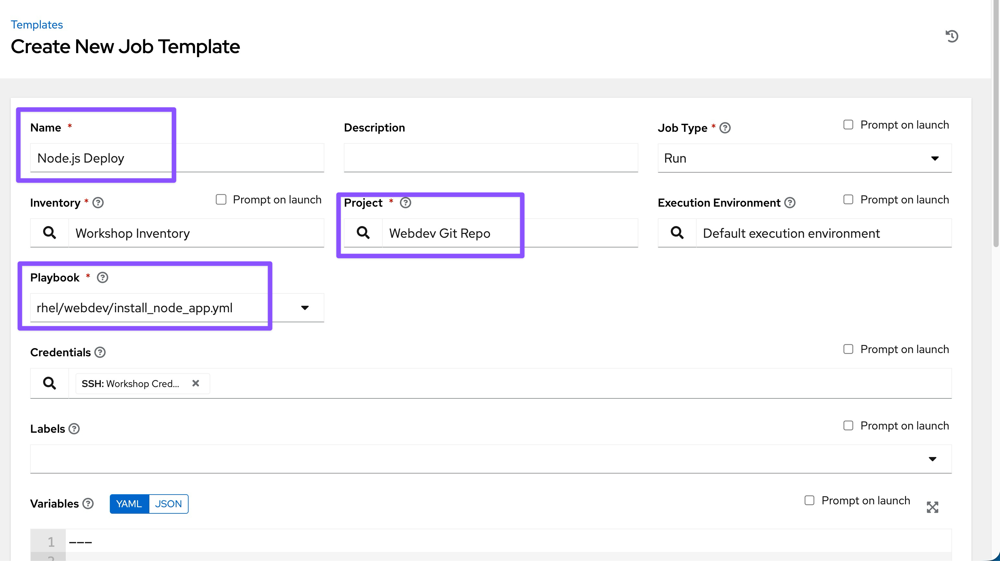
---

### Set up the workflow

1. Go to **Resources → Templates**, click the **Add** button, and choose **Add workflow job Template**.

* If you do not see the `Resources` menu on the side, your environment is likely running Ansible Automation Platform version 2.5 or later. In that case, go to the **Automation Execution -> Templates** view,click the **Create workflow template** button.

Fill in the details:

<table>
  <tr>
    <th>Parameter</th>
    <th>Value</th>
  </tr>
  <tr>
    <td>Name</td>
    <td>Deploy Webapp Server</td>
  </tr>
</table>

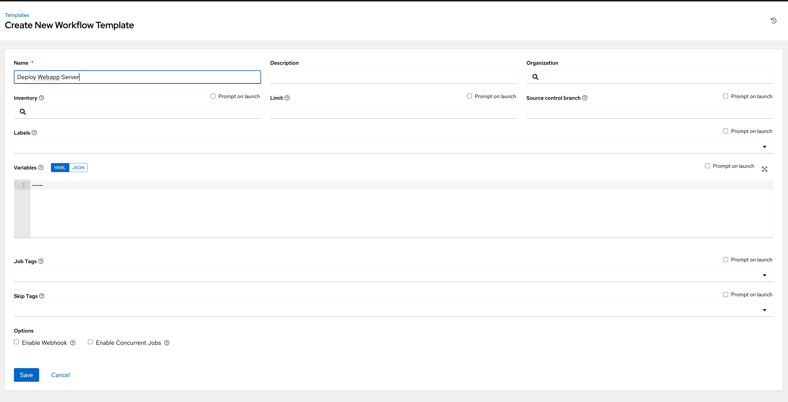

2. Click **Save** or **Create workflow job template** to open the **Workflow Visualizer**. 

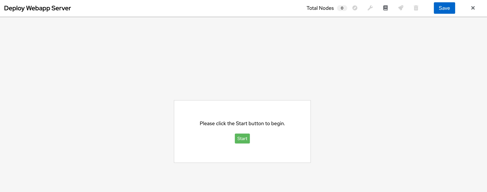

3. Click the **Start** button and assign the **Web App Deploy** job template to the first node. 

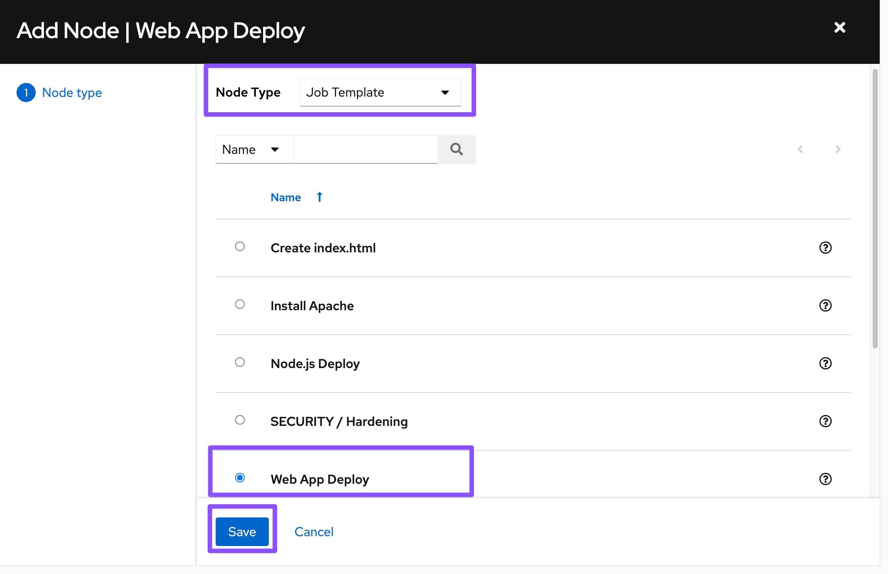

4. Click **Save**. 

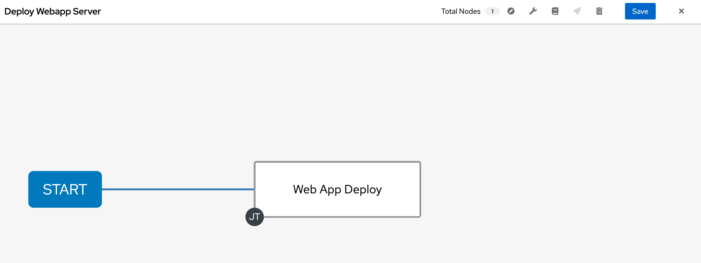

5. Add a second node by clicking over the first "Web App Deploy" node, and click on `+` icon. 
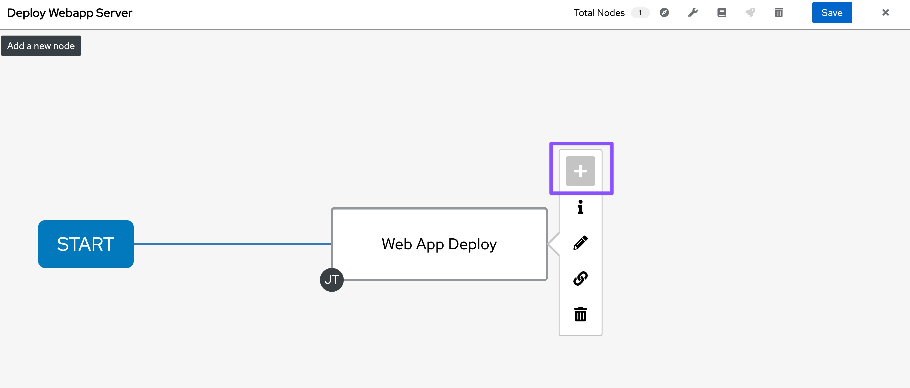

6. Select "On Success" and Click "Next" button. 
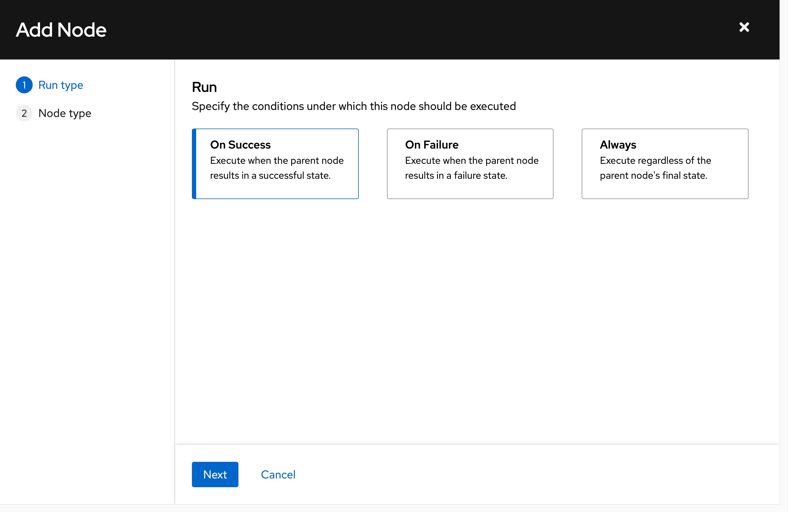

7. Select the "Node.js Deploy" Template and Click on "Save" button. 

8. You will see a green line between first **Web App Deploy** job template and second **Node.js Deploy** template nodes. 

9. Click on `Save` button on top to save the workflow. 

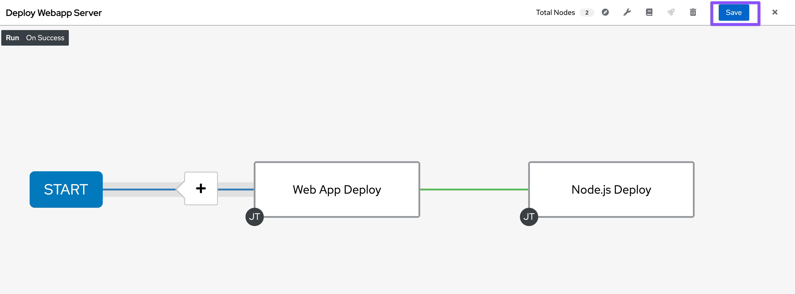

> Warning: Do not move to other menu without saving. It will discard the entire workflow.

---

### Launch workflow

Within the **Deploy Webapp Server** template, click **Launch**. Or From the Templates list , click on the `Rocket` icon.

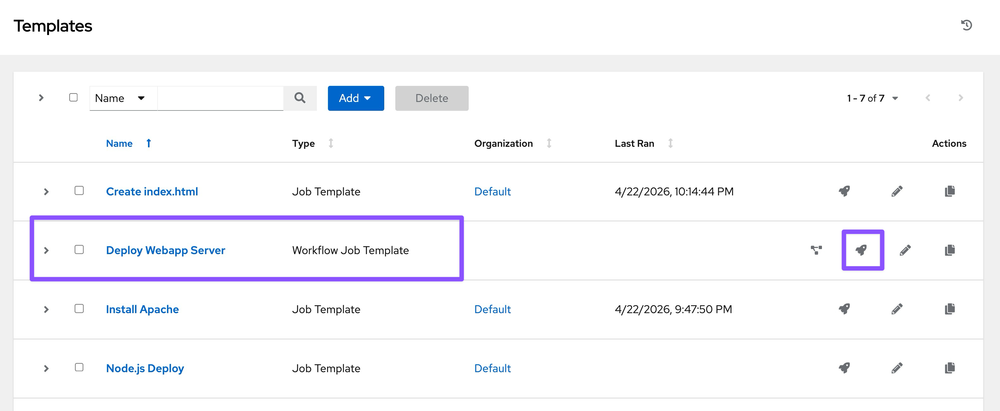

Once the workflow completes, verify the result.

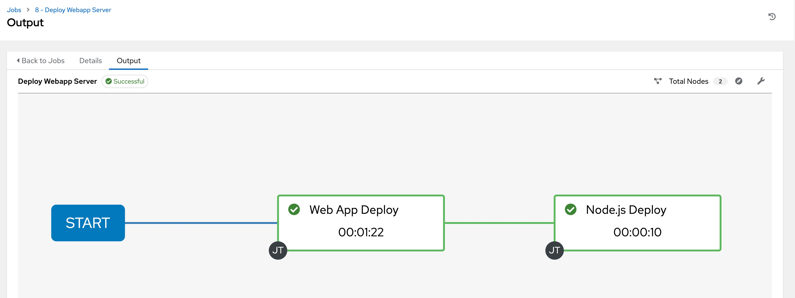

Once the job completes, verify the Apache homepage by running the following `curl http://node1/nodejs` command in the SSH console on the control host (In VS Code Terminal window).
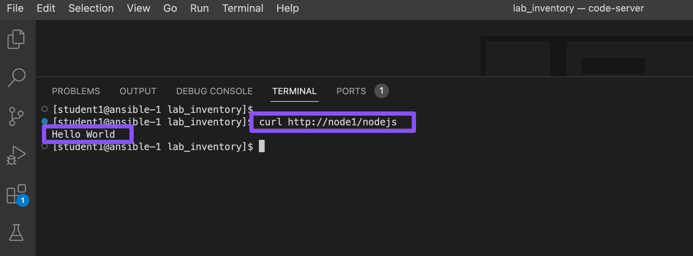

**Alternatively**, You can run adhoc command on `node1`:

* Go to `Resources → Inventories → Workshop Inventory`
  * If you do not see the `Resources` menu on the side, your environment is likely running Ansible Automation Platform version 2.5 or later. In that case, go to **Automation Execution → Infrastructure →  Inventories** → **Workshop Inventory**

Select the Hosts tab and select node1 and click Run Command

Within the Details window, select Module command, in Arguments type `curl http://node1/nodejs` and click Next.

Within the Execution Environment window, select Default execution environment and click Next.

Within the Credential window, select Workshop Credentials and click Next.

Review your inputs and click Finish.

Verify that the output result shows `Hello World`

---