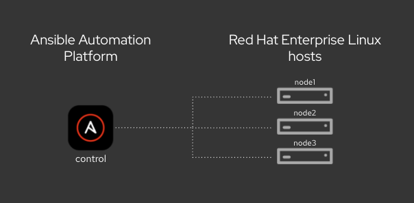

# Ansible Automation Platform Workshop (45 mins)

## Table of Contents

* [Workshop Ovreview](#workshop-overview)
* [Time planning](#time-planning)
* [Lab Diagram](#lab-diagram)
* [Ansible Automation Platform Exercises](#ansible-automation-platform-exercises)

## Workshop Overview

This 45-minute workshop introduces Ansible playbooks and Ansible Automation Platform Controller. It includes 3 hands-on exercises plus 1 optional bonus exercise.

## Time Planning

**Note:** This is a self-paced workshop. Participants can complete the exercises at their own pace. The timings below are indicative only.

| Duration | Topic |
|----------|-------|
| 10 min   | Lab setup overview and Ansible basics |
| 10 min   | First Ansible playbook |
| 10 min   | First Automation Job in Ansible Automation Platform |
| 5 min    | Provide Inputs to Automation via surveys |
| 10 min   | Bonus: Workflows |

## Lab Diagram

## Ansible Automation Platform Exercises

 - [Understanding the lab setup](1-setup)
 - [Ansible Basics](2-thebasics)
 - [Exercise 1 - Writing and running first playbook](3-playbook)
 - [Exercise 2 - Running first automation in Ansible Automation Platform](4-projects)
 - [Exercise 3 - Provide Inputs to Automation via surveys](5-surveys)
 - [Bonus Exercise 4 - Automation Workflows](6-bonus-workflows)

---
